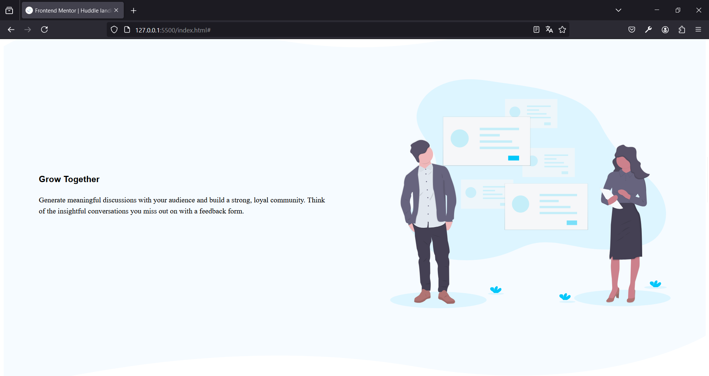

# Frontend Mentor - Huddle landing page with curved sections solution

This is a solution to the [Huddle landing page with curved sections challenge on Frontend Mentor](https://www.frontendmentor.io/challenges/huddle-landing-page-with-curved-sections-5ca5ecd01e82137ec91a50f2). Frontend Mentor challenges help you improve your coding skills by building realistic projects. 

## Table of contents

- [Overview](#overview)
  - [The challenge](#the-challenge)
  - [Screenshot](#screenshot)
  - [Links](#links)
- [My process](#my-process)
  - [Built with](#built-with)
  - [What I learned](#what-i-learned)
  - [Continued development](#continued-development)
  - [Useful resources](#useful-resources)
- [Author](#author)
- [Acknowledgments](#acknowledgments)


## Overview

### The challenge

Users should be able to:

- View the optimal layout for the site depending on their device's screen size
- See hover states for all interactive elements on the page

### Screenshot




### Links

- Solution URL: [https://www.frontendmentor.io/challenges/huddle-landing-page-with-curved-sections-5ca5ecd01e82137ec91a50f2/hub]
- Live Site URL: [https://huddlelandingpage-albertovama.netlify.app]

## My process

### Built with

- Semantic HTML5 markup
- CSS custom properties
- Flexbox
- CSS Grid
- Media Query


### What I learned

Use this section to recap over some of your major learnings while working through this project. Writing these out and providing code samples of areas you want to highlight is a great way to reinforce your own knowledge.

To see how you can add code snippets, see below:

```html
    <div class="your-users-container section-block">
      <div class="your-users-top-curve">
        
      </div>

      <div class="container">
        <div class="section-flex">
          <div class="grow-section-text">
            <h3>Your Users</h3>
            <p> Generate meaningful discussions with your audience and build a strong, loyal community. 
            Think of the insightful conversations you miss out on with a feedback form. </p>
          </div>

          <div class="grow-img">
            
          </div>

        </div>
      </div> <!-- container-yu -->

      <div class="your-users-bottom-curve">
        
      </div>

    </div> <!-- your-section-container -->
```
```css
.grow-section-top-curve img,
.your-users-top-curve img{
    background-color: #FFF;
    width: 100%;
}
.title__button--pink a{
    color: #fff;
    background-color: var(--Pink);
    border-radius: 1rem;
    text-decoration: none;
    padding: 0.6rem 2rem;
}

.title__button--pink a:hover{
    background-color: hsla(322,100%,66%,0.7);
}
```


### Continued development

I want to improve my Front End skills. The reason is that im heading to a job and gain money to buy and give special gifts to my family.


### Useful resources

- [https://www.youtube.com/watch?v=6mLmW_zfY1U&t=1005s] - This vidio helped me to do the "flowing" objects.


## Author

- Frontend Mentor - [@AlbertoVaMa](https://www.frontendmentor.io/profile/AlbertoVaMa)
- Twitter - [@Betungas18]

